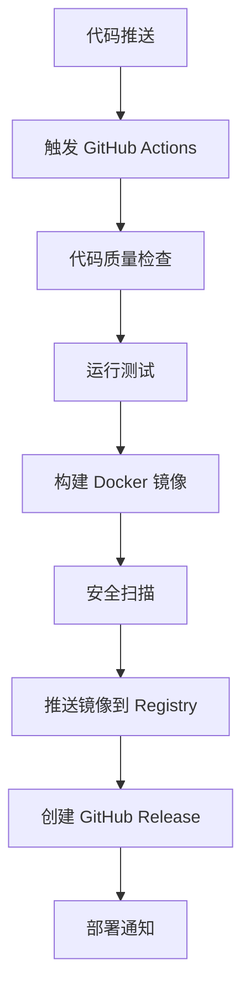

# Flow Balance CI/CD 流水线详细配置指南

## 📋 概述

本文档详细说明 Flow Balance 项目的 CI/CD 流水线配置，包括 GitHub
Actions 工作流、Docker 镜像构建和自动化部署。

## 🔄 CI/CD 流水线架构



## 📁 工作流文件结构

```
.github/
└── workflows/
    ├── ci.yml              # 持续集成工作流
    └── docker-build.yml    # Docker 构建和发布工作流
```

## 🔧 CI 工作流配置 (ci.yml)

### 触发条件

```yaml
on:
  push:
    branches: [main, develop]
  pull_request:
    branches: [main, develop]
```

### 工作流程说明

#### 1. 代码质量检查 (lint-and-test)

```yaml
jobs:
  lint-and-test:
    runs-on: ubuntu-latest
    strategy:
      matrix:
        node-version: [18.x, 20.x] # 测试多个 Node.js 版本
```

**执行步骤：**

- 检出代码
- 设置 Node.js 环境
- 安装 pnpm
- 缓存依赖
- 安装项目依赖
- 生成 Prisma 客户端
- 运行 ESLint 检查
- 运行 Prettier 格式检查
- 运行 TypeScript 类型检查
- 运行单元测试
- 上传测试覆盖率报告

#### 2. 构建检查 (build-check)

```yaml
build-check:
  runs-on: ubuntu-latest
```

**执行步骤：**

- 检出代码
- 设置 Node.js 环境
- 安装依赖
- 生成 Prisma 客户端
- 构建应用
- 验证构建输出

#### 3. 数据库迁移检查 (database-check)

```yaml
database-check:
  runs-on: ubuntu-latest
  services:
    postgres:
      image: postgres:15
      env:
        POSTGRES_PASSWORD: postgres
        POSTGRES_DB: flowbalance_test
```

**执行步骤：**

- 测试 SQLite 数据库迁移
- 测试 PostgreSQL 数据库迁移
- 验证 Prisma schema 正确性

#### 4. 安全检查 (security-check)

```yaml
security-check:
  runs-on: ubuntu-latest
```

**执行步骤：**

- 运行 npm audit 安全审计
- 运行 CodeQL 代码分析
- 检查依赖漏洞

## 🐳 Docker 构建工作流配置 (docker-build.yml)

### 触发条件

```yaml
on:
  push:
    branches: [main, develop]
    tags: ['v*']
  pull_request:
    branches: [main, develop]
```

### 环境变量

```yaml
env:
  REGISTRY: ghcr.io
  IMAGE_NAME: ${{ github.repository }}
```

### 工作流程说明

#### 1. 代码质量检查 (quality-check)

- 运行与 CI 工作流相同的质量检查
- 确保只有通过检查的代码才能构建镜像

#### 2. Docker 镜像构建 (docker-build)

```yaml
docker-build:
  needs: quality-check
  runs-on: ubuntu-latest
  permissions:
    contents: read
    packages: write
```

**执行步骤：**

- 检出代码
- 设置 Docker Buildx（支持多架构构建）
- 登录 GitHub Container Registry
- 提取镜像元数据（标签、标签）
- 构建并推送 Docker 镜像

**支持的架构：**

- linux/amd64
- linux/arm64

**镜像标签策略：**

```yaml
tags: |
  type=ref,event=branch          # 分支名作为标签
  type=ref,event=pr              # PR 号作为标签
  type=semver,pattern={{version}} # 语义化版本
  type=semver,pattern={{major}}.{{minor}}
  type=semver,pattern={{major}}
  type=raw,value=latest,enable={{is_default_branch}}
```

#### 3. 安全扫描 (security-scan)

```yaml
security-scan:
  needs: docker-build
  runs-on: ubuntu-latest
```

**执行步骤：**

- 使用 Trivy 扫描 Docker 镜像漏洞
- 生成 SARIF 格式的安全报告
- 上传结果到 GitHub Security 标签

#### 4. 自动发布 (release)

```yaml
release:
  needs: [quality-check, docker-build]
  runs-on: ubuntu-latest
  if: startsWith(github.ref, 'refs/tags/v')
```

**执行步骤：**

- 仅在创建版本标签时触发
- 自动创建 GitHub Release
- 生成发布说明
- 包含 Docker 镜像使用说明

## 🏷️ 镜像标签和版本管理

### 标签命名规则

| 触发条件            | 标签示例                      | 说明              |
| ------------------- | ----------------------------- | ----------------- |
| 推送到 main 分支    | `latest`, `main`              | 最新开发版本      |
| 推送到 develop 分支 | `develop`                     | 开发分支版本      |
| 创建 PR             | `pr-123`                      | Pull Request 版本 |
| 创建版本标签 v1.2.3 | `v1.2.3`, `1.2.3`, `1.2`, `1` | 正式发布版本      |

### 版本发布流程

#### 自动发布（推荐）

```bash
# 使用发布脚本
./scripts/release.sh patch   # 1.0.0 -> 1.0.1
./scripts/release.sh minor   # 1.0.1 -> 1.1.0
./scripts/release.sh major   # 1.1.0 -> 2.0.0

# 或使用 Makefile
make release-patch
make release-minor
make release-major
```

#### 手动发布

```bash
# 1. 更新版本号
npm version patch

# 2. 推送标签
git push origin --tags

# 3. GitHub Actions 自动构建和发布
```

## 🔐 密钥和环境变量配置

### GitHub Secrets 配置

在仓库 **Settings** > **Secrets and variables** > **Actions** 中配置：

#### 必需的 Secrets

```bash
# GitHub Container Registry 自动配置，无需手动设置
GITHUB_TOKEN  # 自动提供

# 可选：其他 Registry
DOCKER_USERNAME=your-docker-username
DOCKER_PASSWORD=your-docker-password
```

#### 可选的 Variables

```bash
# 应用配置
APP_NAME=flow-balance
REGISTRY_NAMESPACE=jomonylw
```

### 环境变量使用

在工作流中使用环境变量：

```yaml
env:
  NODE_ENV: production
  NEXT_TELEMETRY_DISABLED: 1

steps:
  - name: Build application
    run: npm run build
    env:
      DATABASE_URL: ${{ secrets.DATABASE_URL }}
      JWT_SECRET: ${{ secrets.JWT_SECRET }}
```

## 📊 监控和通知

### 构建状态徽章

在 README.md 中添加状态徽章：

```markdown


```

### 失败通知

GitHub Actions 会自动发送以下通知：

- 构建失败邮件通知
- PR 状态检查
- Security 标签中的漏洞报告

### 自定义通知

可以添加 Slack、Discord 等通知：

```yaml
- name: Notify Slack
  if: failure()
  uses: 8398a7/action-slack@v3
  with:
    status: failure
    webhook_url: ${{ secrets.SLACK_WEBHOOK }}
```

## 🔧 高级配置

### 条件执行

```yaml
# 仅在 main 分支执行部署
- name: Deploy to production
  if: github.ref == 'refs/heads/main'
  run: echo "Deploying to production"

# 仅在标签推送时创建 Release
- name: Create Release
  if: startsWith(github.ref, 'refs/tags/v')
  uses: actions/create-release@v1
```

### 矩阵构建

```yaml
strategy:
  matrix:
    os: [ubuntu-latest, windows-latest, macos-latest]
    node-version: [18.x, 20.x]
    database: [sqlite, postgresql]
```

### 缓存优化

```yaml
- name: Cache dependencies
  uses: actions/cache@v3
  with:
    path: ~/.pnpm-store
    key: ${{ runner.os }}-pnpm-${{ hashFiles('**/pnpm-lock.yaml') }}
    restore-keys: |
      ${{ runner.os }}-pnpm-
```

### 并行执行

```yaml
jobs:
  test:
    runs-on: ubuntu-latest

  build:
    runs-on: ubuntu-latest

  deploy:
    needs: [test, build] # 等待 test 和 build 完成
    runs-on: ubuntu-latest
```

## 🐛 故障排除

### 常见问题和解决方案

#### 1. 权限问题

```yaml
# 确保工作流有正确的权限
permissions:
  contents: read
  packages: write
  security-events: write
```

#### 2. 依赖安装失败

```bash
# 检查 pnpm-lock.yaml 是否提交
# 使用 --frozen-lockfile 确保一致性
pnpm install --frozen-lockfile
```

#### 3. Docker 构建失败

```dockerfile
# 检查 Dockerfile 中的路径和权限
# 确保 .dockerignore 正确配置
```

#### 4. 测试失败

```bash
# 本地运行测试确保通过
npm test

# 检查测试环境配置
cat jest.config.js
```

### 调试技巧

#### 启用调试日志

```yaml
- name: Debug information
  run: |
    echo "GitHub ref: ${{ github.ref }}"
    echo "GitHub event: ${{ github.event_name }}"
    echo "Runner OS: ${{ runner.os }}"
    env
```

#### 使用 tmate 进行远程调试

```yaml
- name: Setup tmate session
  if: failure()
  uses: mxschmitt/action-tmate@v3
```

## 📚 最佳实践

### 1. 安全最佳实践

- 使用最小权限原则
- 定期轮换密钥
- 不在日志中输出敏感信息
- 使用 OIDC 代替长期 token

### 2. 性能优化

- 使用缓存减少构建时间
- 并行执行独立任务
- 使用适当的运行器规格

### 3. 可维护性

- 使用可重用的工作流
- 添加详细的注释
- 定期更新 Action 版本

### 4. 监控和告警

- 设置构建失败通知
- 监控构建时间趋势
- 定期检查安全漏洞

## 📖 相关文档

- [GitHub Setup Guide](GITHUB_SETUP_GUIDE.md) - GitHub 仓库设置指南
- [Deployment Guide](DEPLOYMENT_GUIDE.md) - 部署指南
- [Project Status](../PROJECT_STATUS.md) - 项目状态

通过遵循本指南，您可以建立一个强大、安全、高效的 CI/CD 流水线！🚀
