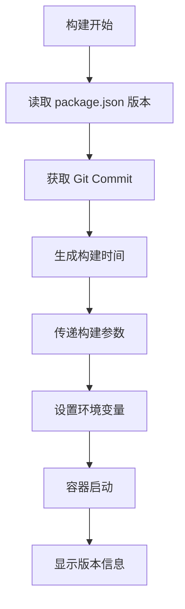

# 🔧 Docker 版本信息修复说明

## 🎯 问题描述

在 Docker 日志中，Build Date 和 Version 显示为 "unknown"：

```
🎉 Flow Balance is ready!
📊 Database: postgresql
🌐 Port: 3000
🔧 Environment: production
📅 Build Date: unknown  ← 问题
🏷️  Version: unknown   ← 问题
```

## 🔍 根本原因

1. **Dockerfile 缺少构建参数声明**：没有接受 `BUILD_DATE` 和 `GIT_COMMIT` 构建参数
2. **GitHub Actions 未传递构建参数**：CI/CD 流水线没有传递版本信息
3. **环境变量未正确设置**：构建参数没有转换为运行时环境变量
4. **版本信息获取逻辑不完整**：entrypoint 脚本缺少 fallback 逻辑

## ✅ 修复方案

### 1. 更新 Dockerfile

**修改内容：**

- 在 builder 和 runner 阶段添加 `ARG BUILD_DATE` 和 `ARG GIT_COMMIT`
- 将构建参数转换为环境变量：`ENV NEXT_PUBLIC_BUILD_DATE=${BUILD_DATE}`
- 确保版本信息在运行时可用

**关键变更：**

```dockerfile
# Stage 2: Builder
ARG BUILD_DATE
ARG GIT_COMMIT
ENV NEXT_PUBLIC_BUILD_DATE=${BUILD_DATE}
ENV NEXT_PUBLIC_GIT_COMMIT=${GIT_COMMIT}

# Stage 3: Runner
ARG BUILD_DATE
ARG GIT_COMMIT
ENV NEXT_PUBLIC_BUILD_DATE=${BUILD_DATE}
ENV NEXT_PUBLIC_GIT_COMMIT=${GIT_COMMIT}
```

### 2. 更新 GitHub Actions 工作流

**修改内容：**

- 在 `docker/build-push-action@v5` 中添加 `build-args`
- 传递构建日期和 Git commit 信息

**关键变更：**

```yaml
- name: Build and push Docker image
  uses: docker/build-push-action@v5
  with:
    build-args: |
      BUILD_DATE=${{ fromJSON(steps.meta.outputs.json).labels['org.opencontainers.image.created'] }}
      GIT_COMMIT=${{ github.sha }}
```

### 3. 更新本地构建脚本

**修改内容：**

- `scripts/docker-build.sh` 添加版本信息获取
- `scripts/build-optimized.sh` 添加构建参数传递

**关键变更：**

```bash
BUILD_DATE=$(date -u +"%Y-%m-%dT%H:%M:%SZ")
GIT_COMMIT=$(git rev-parse --short HEAD 2>/dev/null || echo "unknown")
APP_VERSION=$(node -p "require('./package.json').version" 2>/dev/null || echo "unknown")

docker build \
    --build-arg BUILD_DATE="$BUILD_DATE" \
    --build-arg GIT_COMMIT="$GIT_COMMIT" \
    --tag "$FULL_IMAGE_NAME" \
    .
```

### 4. 更新 Docker Entrypoint

**修改内容：**

- 增强版本信息获取逻辑
- 添加 fallback 机制从 package.json 读取版本
- 改进启动信息显示

**关键变更：**

```bash
# 获取版本信息
APP_VERSION="${NEXT_PUBLIC_APP_VERSION:-$(node -p "require('./package.json').version" 2>/dev/null || echo "unknown")}"
BUILD_DATE="${NEXT_PUBLIC_BUILD_DATE:-unknown}"
GIT_COMMIT="${NEXT_PUBLIC_GIT_COMMIT:-unknown}"

# 显示启动信息
echo "📅 Build Date: $BUILD_DATE"
echo "🏷️  Version: $APP_VERSION"
if [ "$GIT_COMMIT" != "unknown" ]; then
    echo "🔗 Git Commit: $GIT_COMMIT"
fi
```

## 🧪 测试方法

### 1. 本地测试

```bash
# 使用本地构建脚本
./scripts/docker-build.sh

# 运行容器并查看日志
docker run --rm flow-balance:latest

# 预期输出：
# 📅 Build Date: 2025-01-07T10:30:45Z
# 🏷️  Version: 1.0.0
# 🔗 Git Commit: abc1234
```

### 2. GitHub Actions 测试

```bash
# 推送代码触发 CI/CD
git add .
git commit -m "fix: Docker version information display"
git push origin main

# 检查 GitHub Actions 日志
# 检查 GitHub Container Registry 中的镜像
```

### 3. 生产环境测试

```bash
# 拉取最新镜像
docker pull ghcr.io/jomonylw/flow-balance:latest

# 运行并检查版本信息
docker run --rm ghcr.io/jomonylw/flow-balance:latest
```

## 📋 预期结果

修复后，Docker 容器启动时应显示：

```
🎉 Flow Balance is ready!
📊 Database: postgresql
🌐 Port: 3000
🔧 Environment: production
📅 Build Date: 2025-01-07T10:30:45Z  ✅
🏷️  Version: 1.0.0                   ✅
🔗 Git Commit: abc1234               ✅
```

## 🔄 版本信息流程



## 🚀 部署建议

1. **立即生效**：推送代码到 main 分支，GitHub Actions 自动构建新镜像
2. **向后兼容**：现有部署不受影响，新镜像包含版本信息
3. **监控验证**：部署后检查容器日志确认版本信息正确显示

## 📝 相关文件

- `Dockerfile` - 主要 Docker 构建文件
- `Dockerfile.optimized` - 优化版 Docker 构建文件
- `scripts/docker-build.sh` - 本地构建脚本
- `scripts/build-optimized.sh` - 优化构建脚本
- `scripts/docker-entrypoint.sh` - 容器启动脚本
- `.github/workflows/docker-build.yml` - GitHub Actions 工作流
