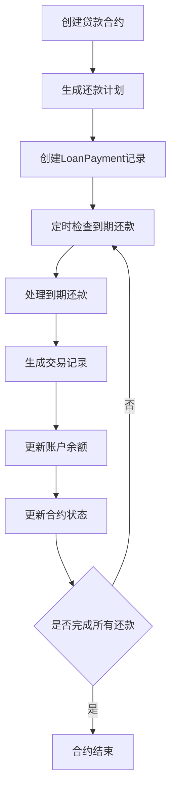

# 负债账户贷款合约业务流程分析

## 概述

本文档详细分析负债账户贷款合约的完整业务流程，包括合约管理、还款计划处理、自动还款执行等各个环节，并指出当前实现中的问题和优化建议。

## 1. 业务流程概览



## 2. 数据模型分析

### 2.1 核心表结构

#### LoanContract (贷款合约表)

- **主要字段**: 合约基本信息、还款参数、关联账户
- **约束**: 一个账户最多只能有一个贷款合约
- **状态管理**: isActive, currentPeriod

#### LoanPayment (贷款还款记录表)

- **主要字段**: 期数、还款金额、关联交易ID
- **状态管理**: status (PENDING, COMPLETED, FAILED)
- **唯一约束**: (loanContractId, period)

#### Transaction (交易表)

- **关联字段**: loanContractId, loanPaymentId
- **特殊关联**: principalPayments, interestPayments, balancePayments

### 2.2 数据关系

- LoanContract 1:N LoanPayment
- LoanPayment 1:1 Transaction (本金)
- LoanPayment 1:1 Transaction (利息)
- LoanPayment 1:1 Transaction (余额调整)

## 3. 详细业务流程

### 3.1 贷款合约创建流程

#### 3.1.1 前端操作

1. 用户在负债账户详情页点击创建贷款合约
2. 填写合约信息：
   - 合约名称、贷款金额、利率、总期数
   - 还款类型（等额本息/等额本金/只还利息）
   - 开始日期、每月还款日
   - 还款账户（支出类型，货币一致）
   - 交易模板信息（描述、备注、标签）

#### 3.1.2 后端处理

1. **数据验证**:

   - 基础字段完整性检查
   - 贷款参数合理性验证（LoanCalculationService.validateLoanParameters）
   - 账户唯一性检查（一个账户最多一个合约）

2. **合约创建**:

   ```typescript
   // 创建贷款合约记录
   const loanContract = await prisma.loanContract.create({...})

   // 生成完整还款计划
   await LoanContractService.generateLoanPaymentSchedule(loanContract.id, userId)
   ```

3. **还款计划生成**:
   - 使用LoanCalculationService计算所有期数的还款信息
   - 批量创建LoanPayment记录，状态为PENDING
   - 计算每期的具体还款日期

### 3.2 还款计划处理

#### 3.2.1 计算逻辑

LoanCalculationService提供三种还款方式：

- **等额本息** (EQUAL_PAYMENT): 每月还款额固定
- **等额本金** (EQUAL_PRINCIPAL): 每月本金固定
- **只还利息** (INTEREST_ONLY): 前期只还利息，最后一期还本金

#### 3.2.2 数据生成

```typescript
// 为每期生成LoanPayment记录
for (let period = 1; period <= totalPeriods; period++) {
  const paymentInfo = calculation.schedule[period - 1]
  const paymentDate = calculatePaymentDate(startDate, period, paymentDay)

  loanPayments.push({
    loanContractId,
    userId,
    period,
    paymentDate,
    principalAmount: paymentInfo.principalAmount,
    interestAmount: paymentInfo.interestAmount,
    totalAmount: paymentInfo.totalAmount,
    remainingBalance: paymentInfo.remainingBalance,
    status: 'PENDING',
  })
}
```

### 3.3 自动还款执行流程

#### 3.3.1 触发机制

通过UnifiedSyncService统一管理：

1. **用户登录时触发**: 检查是否需要同步
2. **定时检查**: 基于lastRecurringSync时间戳
3. **手动触发**: 用户主动刷新

#### 3.3.2 执行逻辑

```typescript
// 1. 获取到期的PENDING还款记录
const duePayments = await prisma.loanPayment.findMany({
  where: {
    paymentDate: { lte: today },
    status: 'PENDING',
  },
})

// 2. 逐个处理还款记录
for (const payment of duePayments) {
  await processLoanPaymentRecord(payment.id)
}
```

#### 3.3.3 单个还款处理

```typescript
async function processLoanPaymentRecord(loanPaymentId: string) {
  await prisma.$transaction(async (tx) => {
    // 1. 创建本金还款交易（支出）
    const principalTransaction = await tx.transaction.create({
      data: {
        userId,
        accountId: paymentAccountId,
        categoryId: principalCategoryId,
        type: 'EXPENSE',
        amount: principalAmount,
        description: '贷款本金还款',
        date: paymentDate
      }
    })

    // 2. 创建利息支出交易
    const interestTransaction = await tx.transaction.create({...})

    // 3. 创建负债账户余额调整交易
    const balanceTransaction = await tx.transaction.create({
      data: {
        accountId: loanContract.accountId,
        type: 'BALANCE_ADJUSTMENT',
        amount: -principalAmount, // 负债减少
        ...
      }
    })

    // 4. 更新LoanPayment状态
    await tx.loanPayment.update({
      where: { id: loanPaymentId },
      data: {
        status: 'COMPLETED',
        processedAt: new Date(),
        principalTransactionId: principalTransaction.id,
        interestTransactionId: interestTransaction.id,
        balanceTransactionId: balanceTransaction.id
      }
    })

    // 5. 更新贷款合约状态
    await tx.loanContract.update({
      where: { id: loanContractId },
      data: {
        currentPeriod: payment.period,
        isActive: payment.period < totalPeriods
      }
    })
  })
}
```

## 4. 当前实现问题分析

### 4.1 数据一致性问题

#### 问题1: 字段名称不一致

- LoanContract表中使用`totalPeriods`
- 但在某些API验证中使用`loanTerm`
- **影响**: 可能导致更新操作失败

#### 问题2: 缺少nextPaymentDate字段

- 代码中引用了`loanContract.nextPaymentDate`
- 但数据库schema中没有此字段
- **影响**: 还款处理逻辑可能出错

### 4.2 业务逻辑问题

#### 问题1: 重复的还款处理逻辑

- `processLoanPayment()`: 基于当前日期和paymentDay判断
- `processLoanPaymentsBySchedule()`: 基于LoanPayment记录的paymentDate
- **影响**: 逻辑混乱，可能导致重复处理

#### 问题2: 分类账户处理不完整

- 创建合约时没有自动创建本金和利息分类
- 依赖用户手动设置principalCategoryId和interestCategoryId
- **影响**: 用户体验差，可能导致分类错误

### 4.3 错误处理问题

#### 问题1: 事务回滚不完整

- 部分操作没有包含在事务中
- 失败时可能导致数据不一致
- **影响**: 数据完整性风险

#### 问题2: 错误信息不够详细

- 缺少具体的错误上下文
- 难以定位问题原因
- **影响**: 调试和维护困难

## 5. 优化建议

### 5.1 数据模型优化

#### 建议1: 统一字段命名

```sql
-- 确保所有地方都使用totalPeriods
ALTER TABLE loan_contracts ADD COLUMN next_payment_date DATE;
```

#### 建议2: 增加必要字段

```sql
-- 添加下次还款日期字段
ALTER TABLE loan_contracts ADD COLUMN next_payment_date DATE;
-- 添加合约状态枚举
ALTER TABLE loan_contracts ADD COLUMN contract_status ENUM('ACTIVE', 'COMPLETED', 'SUSPENDED');
```

### 5.2 业务逻辑优化

#### 建议1: 简化还款处理逻辑

- 统一使用基于LoanPayment记录的处理方式
- 移除基于当前日期判断的旧逻辑
- 确保处理逻辑的一致性

#### 建议2: 自动创建分类账户

```typescript
// 在创建贷款合约时自动创建相关分类
const principalCategory = await createOrGetCategory(userId, '贷款本金', 'EXPENSE')
const interestCategory = await createOrGetCategory(userId, '贷款利息', 'EXPENSE')
```

### 5.3 错误处理优化

#### 建议1: 完善事务处理

- 确保所有相关操作都在同一事务中
- 添加详细的错误日志
- 实现失败重试机制

#### 建议2: 增强监控和告警

- 添加还款处理状态监控
- 实现异常情况告警
- 提供手动修复工具

## 6. 总结

当前的贷款合约业务流程在整体架构上是合理的，但在实现细节上存在一些问题需要优化：

1. **数据一致性**: 需要统一字段命名和补充缺失字段
2. **业务逻辑**: 需要简化和统一还款处理逻辑
3. **错误处理**: 需要完善事务处理和错误监控
4. **用户体验**: 需要自动化更多操作，减少用户手动配置

建议按照优先级逐步实施这些优化，确保系统的稳定性和可维护性。

## 7. 详细代码流程分析

### 7.1 合约创建完整流程

#### 前端组件调用链

```
StockAccountDetailView.tsx
  ↓ handleSaveLoanContract()
  ↓ POST /api/loan-contracts
LoanContractModal.tsx
  ↓ 表单数据收集和验证
  ↓ onSave(formData)
```

#### 后端API处理链

```
/api/loan-contracts/route.ts (POST)
  ↓ 数据验证和权限检查
  ↓ LoanContractService.createLoanContract()
  ↓ LoanCalculationService.validateLoanParameters()
  ↓ prisma.loanContract.create()
  ↓ LoanContractService.generateLoanPaymentSchedule()
  ↓ LoanCalculationService.calculateLoan()
  ↓ prisma.loanPayment.createMany()
```

### 7.2 自动还款执行流程

#### 触发时机

1. **用户登录时**: 通过middleware检查
2. **页面加载时**: 通过UserDataContext
3. **手动刷新时**: 通过API调用

#### 执行链路

```
UnifiedSyncService.triggerUserSync()
  ↓ processCurrentLoanPayments()
  ↓ LoanContractService.processLoanPaymentsBySchedule()
  ↓ processLoanPaymentRecord() (for each due payment)
  ↓ prisma.$transaction()
    ↓ 创建本金还款交易
    ↓ 创建利息支出交易
    ↓ 创建余额调整交易
    ↓ 更新LoanPayment状态
    ↓ 更新LoanContract状态
```

### 7.3 数据查询和展示流程

#### 合约列表查询

```
LoanContractsList.tsx
  ↓ useEffect(() => fetchContracts())
  ↓ GET /api/accounts/{accountId}/loan-contracts
  ↓ LoanContractService.getAccountLoanContracts()
  ↓ prisma.loanContract.findMany() with includes
```

#### 还款记录查询

```
GET /api/loan-contracts/{id}/payments
  ↓ prisma.loanPayment.findMany()
  ↓ include: principalTransaction, interestTransaction, balanceTransaction
```

## 8. 关键问题深度分析

### 8.1 并发处理问题

#### 问题描述

当多个用户同时登录或多个进程同时执行同步时，可能出现：

- 重复处理同一笔还款
- 数据竞争导致状态不一致

#### 当前防护措施

- 使用数据库事务
- LoanPayment状态检查 (status === 'PENDING')
- 唯一约束 (loanContractId, period)

#### 潜在风险

- 缺少分布式锁机制
- 事务隔离级别可能不够

#### 解决方案

```typescript
// 添加分布式锁
async function processLoanPaymentWithLock(loanPaymentId: string) {
  const lockKey = `loan_payment_${loanPaymentId}`
  const lock = await acquireLock(lockKey, 30000) // 30秒超时

  try {
    return await processLoanPaymentRecord(loanPaymentId)
  } finally {
    await releaseLock(lock)
  }
}
```

### 8.2 数据完整性问题

#### 问题1: 交易记录与还款记录不匹配

- LoanPayment记录已创建，但关联的Transaction创建失败
- 导致数据不一致，难以追踪

#### 解决方案

```typescript
// 增强事务处理和回滚机制
await prisma.$transaction(
  async tx => {
    try {
      // 所有操作
      const transactions = await createPaymentTransactions(tx, paymentInfo)
      const loanPayment = await updateLoanPayment(tx, loanPaymentId, transactions)
      const loanContract = await updateLoanContract(tx, loanContractId, period)

      // 验证数据完整性
      await validateDataIntegrity(tx, loanPayment, transactions)
    } catch (error) {
      // 记录详细错误信息
      await logTransactionError(loanPaymentId, error)
      throw error
    }
  },
  {
    isolationLevel: 'Serializable', // 最高隔离级别
  }
)
```

#### 问题2: 余额计算错误

- 负债账户余额更新可能不准确
- 缺少余额验证机制

#### 解决方案

```typescript
// 添加余额验证
async function validateAccountBalance(accountId: string, expectedChange: number) {
  const account = await prisma.account.findUnique({
    where: { id: accountId },
    include: { transactions: true },
  })

  const calculatedBalance = calculateBalanceFromTransactions(account.transactions)
  const currentBalance = account.currentBalance

  if (Math.abs(calculatedBalance - currentBalance) > 0.01) {
    throw new Error(`账户余额不一致: 计算值=${calculatedBalance}, 当前值=${currentBalance}`)
  }
}
```

### 8.3 性能优化问题

#### 问题1: 批量处理效率低

- 逐个处理还款记录，性能较差
- 大量贷款合约时可能超时

#### 解决方案

```typescript
// 批量处理优化
async function processBatchLoanPayments(paymentIds: string[]) {
  const batchSize = 10
  const results = []

  for (let i = 0; i < paymentIds.length; i += batchSize) {
    const batch = paymentIds.slice(i, i + batchSize)
    const batchPromises = batch.map(id => processLoanPaymentWithRetry(id))
    const batchResults = await Promise.allSettled(batchPromises)
    results.push(...batchResults)
  }

  return results
}
```

#### 问题2: 查询性能问题

- 复杂的关联查询可能较慢
- 缺少适当的数据库索引

#### 解决方案

```sql
-- 添加必要索引
CREATE INDEX idx_loan_payments_due ON loan_payments(payment_date, status);
CREATE INDEX idx_loan_contracts_active ON loan_contracts(user_id, is_active);
CREATE INDEX idx_transactions_loan ON transactions(loan_contract_id, loan_payment_id);
```

## 9. 监控和运维建议

### 9.1 关键指标监控

- 还款处理成功率
- 处理延迟时间
- 数据一致性检查结果
- 错误发生频率和类型

### 9.2 告警机制

- 还款处理失败告警
- 数据不一致告警
- 性能异常告警

### 9.3 运维工具

- 手动重试失败的还款处理
- 数据一致性修复工具
- 还款计划重新生成工具

## 10. 未来扩展建议

### 10.1 功能扩展

- 支持提前还款
- 支持还款计划调整
- 支持多种利率类型（固定/浮动）
- 支持还款宽限期

### 10.2 技术架构优化

- 引入消息队列处理异步任务
- 实现分布式锁机制
- 添加缓存层提升查询性能
- 实现更完善的监控和告警系统
