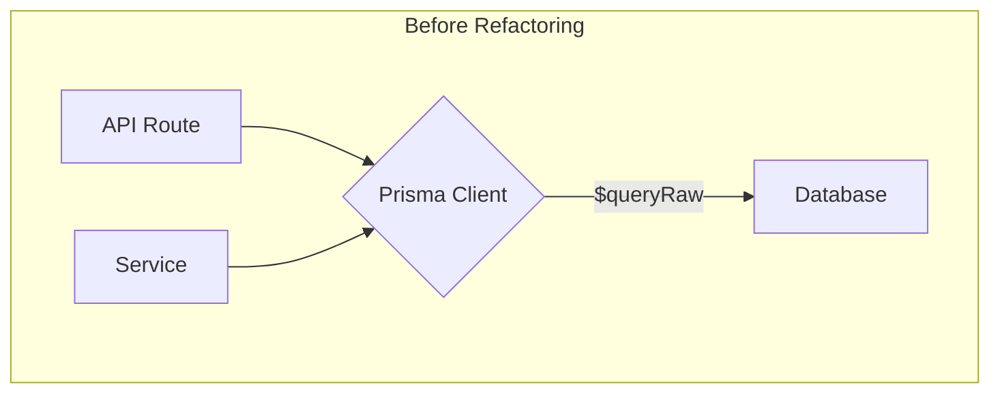
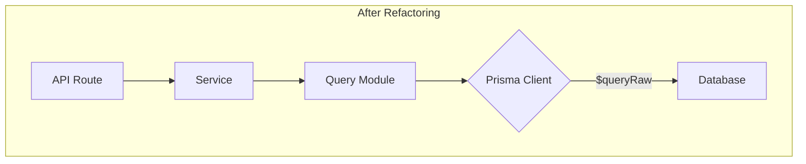

# 原生 SQL 查询重构分析报告

## 1. 目标

将项目中所有分散的原生 SQL 查询统一管理到 `src/lib/database/queries`
目录下，以提高代码的可维护性、可重用性和安全性。

## 2. 业务影响分析

本次重构严格遵循**非侵入性**原则，是一次纯粹的代码结构优化。

- **无业务逻辑变更**: 所有查询的输入参数和输出结果将保持完全一致。业务层调用查询函数的方式会被改变，但其核心业务逻辑（如数据处理、API 响应格式）不会受到任何影响。
- **功能连续性**: 我们将确保每个被重构的查询都经过严格测试，以保证其功能与重构前完全相同。最终用户不会感知到任何功能上的变化。
- **风险可控**: 通过将 SQL 逻辑集中化，我们降低了未来因分散的 SQL 修改而引入业务错误的风险。

总之，本次操作旨在提升代码质量，而不会对现有功能产生任何负面影响。

## 3. 分析总结

通过对 `src`
目录的全面扫描，我们识别出在服务层（`services`）和 API 路由层（`api`）中存在多处原生 SQL 查询。虽然大部分复杂查询已位于
`queries` 目录，但仍有必要将剩余部分进行迁移，以实现完全的关注点分离。

### 受影响的文件列表：

- `src/lib/services/dashboard-query.service.ts`
- `src/app/api/analytics/monthly-summary/route.ts`
- `src/app/api/accounts/[accountId]/details/route.ts`
- `src/app/api/fire/data/route.ts`
- `src/app/api/debug-income-expense/route.ts`
- `src/lib/database/connection-manager.ts`

## 4. 重构方案

### 4.1. 数据流重构

重构的核心思想是隔离数据访问逻辑。API 和服务层应仅负责业务逻辑，而所有数据库交互，特别是原生 SQL，都应封装在
`queries` 模块中。

**重构前:**



**重构后:**



### 4.2. 新的文件结构

我们将在 `src/lib/database/queries/` 目录下引入以下结构来组织查询：

- `dashboard.queries.ts` (现有)
- `account.queries.ts` (现有)
- `analytics.queries.ts` (**新建**)
- `fire.queries.ts` (**新建**)
- `debug.queries.ts` (**新建**)
- `system.queries.ts` (现有)

### 4.3. 统一导入入口

为了创建一个清晰、稳定的公共 API，所有对查询函数的调用都**必须**通过
`src/lib/database/queries/index.ts`
这个统一的入口点。这可以隐藏内部文件结构，使未来的重构（如拆分或合并查询文件）对应用的其他部分完全透明。

**操作步骤**:

1.  在创建新的查询文件（如 `analytics.queries.ts`）后，需要将其导出添加到 `index.ts` 中。
2.  在应用的其他地方（如 API 路由或服务中），导入时应使用路径 `@/lib/database/queries`。

**示例: `index.ts`**

```typescript
// ... 其他导出
export * from './analytics.queries'
export * from './fire.queries'
export * from './debug.queries'
```

**示例: API 路由**

```typescript
import { getMonthlyFlowData } from '@/lib/database/queries'
// 而不是: import { getMonthlyFlowData } from '@/lib/database/queries/analytics.queries';
```

## 5. 详细重构步骤

以下是针对每个文件的具体执行计划：

| 文件路径                                                | 问题描述                                 | 解决方案                                                                                                                                                                                                                             |
| :------------------------------------------------------ | :--------------------------------------- | :----------------------------------------------------------------------------------------------------------------------------------------------------------------------------------------------------------------------------------- |
| **`src/lib/database/queries/index.ts`**                 | 入口文件未导出新建的查询模块。           | 1. 添加 `export * from './analytics.queries'`。<br>2. 添加 `export * from './fire.queries'`。<br>3. 添加 `export * from './debug.queries'`。                                                                                         |
| **`src/lib/services/dashboard-query.service.ts`**       | 包含 3 个仪表盘相关的原生 SQL 查询。     | 1. 将 3 个查询函数移动到 `src/lib/database/queries/dashboard.queries.ts`。<br>2. 更新 `dashboard-query.service.ts` 以从 `@/lib/database/queries` 导入并调用新函数。                                                                  |
| **`src/app/api/analytics/monthly-summary/route.ts`**    | 包含 1 个月度流量数据的原生 SQL 查询。   | 1. 在 `src/lib/database/queries/` 下创建 `analytics.queries.ts`。<br>2. 将查询逻辑封装为 `getMonthlyFlowData` 函数并移入新文件。<br>3. 更新 API 路由以从 `@/lib/database/queries` 导入并调用新函数。                                 |
| **`src/app/api/accounts/[accountId]/details/route.ts`** | 包含 2 个账户相关的原生 SQL 查询。       | 1. 将查询逻辑封装为 `getAccountStats` 和 `getAccountMonthlyData` 函数。<br>2. 将新函数移动到 `src/lib/database/queries/account.queries.ts`。<br>3. 更新 API 路由以从 `@/lib/database/queries` 导入并调用新函数。                     |
| **`src/app/api/fire/data/route.ts`**                    | 包含 2 个 FIRE 计算相关的原生 SQL 查询。 | 1. 在 `src/lib/database/queries/` 下创建 `fire.queries.ts`。<br>2. 将查询逻辑封装为 `getPast12MonthsExpense` 和 `getPast6MonthsIncomeExpense` 函数并移入新文件。<br>3. 更新 API 路由以从 `@/lib/database/queries` 导入并调用新函数。 |
| **`src/app/api/debug-income-expense/route.ts`**         | 包含 1 个调试用的原生 SQL 查询。         | 1. 在 `src/lib/database/queries/` 下创建 `debug.queries.ts`。<br>2. 将查询逻辑封装为 `getRawIncomeExpenseDataForDebug` 函数并移入新文件。<br>3. 更新 API 路由以从 `@/lib/database/queries` 导入并调用新函数。                        |
| **`src/lib/database/connection-manager.ts`**            | 使用 `SELECT 1` 测试数据库连接。         | 1. 修改 `connection-manager.ts`，移除原生 SQL。<br>2. 改为从 `@/lib/database/queries` 导入并调用 `checkDatabaseConnection` 函数。                                                                                                    |

## 6. 优化计划

在完成本次核心重构后，我们建议启动以下优化计划，以进一步提升代码质量和系统性能：

- **增强类型安全**: 为所有原生查询的返回结果定义明确的 TypeScript 接口，替换现有的 `any` 或
  `Array<{...}>` 类型。这将提高代码的可读性和开发阶段的错误捕获能力。
- **全面参数化**: 审查所有查询，确保所有动态输入都通过 Prisma 的模板字符串 (`Prisma.sql`) 或
  `$queryRawUnsafe` 的参数进行传递，以杜绝任何潜在的 SQL 注入风险。
- **性能基准测试**: 对重构后的关键查询（特别是报表和仪表盘查询）建立性能基准。在未来的数据库或代码变更后，可以运行这些测试以确保性能没有下降。
- **逻辑复用**: 在 `queries`
  目录内部，寻找并提取可复用的 SQL 片段或逻辑（例如，日期处理、用户权限检查），将其封装成辅助函数，减少代码重复。

## 7. 下一步

此报告提供了完整的分析和可执行的重构计划。下一步是按照上述步骤，逐一文件进行代码重构。

## 8. 重构实施清单 (Todolist)

### 阶段一：准备工作 (已完成)

- [x] 搜索项目中所有原生 SQL 查询
- [x] 分析查询并进行分类
- [x] 设计新的查询文件结构
- [x] 制定详细的重构步骤
- [x] 完善分析报告，包含业务影响、优化计划和统一导入策略
- [x] 创建 `analytics.queries.ts`, `fire.queries.ts`, `debug.queries.ts` 文件
- [x] 更新 `index.ts` 以导出新模块并修复 lint 错误

### 阶段二：代码重构 (待办)

- [x] **`dashboard-query.service.ts`**: (已完成)
  - [x] 将 3 个查询移动到 `dashboard.queries.ts`
  - [x] 更新服务以从 `@/lib/database/queries` 导入
- [x] **`monthly-summary/route.ts`**: (已完成)
  - [x] 将查询移动到 `analytics.queries.ts`
  - [x] 更新路由以从 `@/lib/database/queries` 导入
- [x] **`details/route.ts`**: (已完成)
  - [x] 将 2 个查询移动到 `account.queries.ts`
  - [x] 更新路由以从 `@/lib/database/queries` 导入
- [x] **`fire/data/route.ts`**: (已完成)
  - [x] 将 2 个查询移动到 `fire.queries.ts`
  - [x] 更新路由以从 `@/lib/database/queries` 导入
- [x] **`debug-income-expense/route.ts`**: (已完成)
  - [x] 将查询移动到 `debug.queries.ts`
  - [x] 更新路由以从 `@/lib/database/queries` 导入
- [x] **`connection-manager.ts`**: (已完成)
  - [x] 移除原生 SQL，改为调用 `checkDatabaseConnection`

### 阶段三：验证与清理

- [ ] 运行所有相关的单元测试和集成测试
- [ ] 手动测试所有受影响的 API 端点和页面功能
- [ ] （可选）根据报告中的建议，移除 `dashboard-query.service.ts`
- [ ] 最终代码审查
